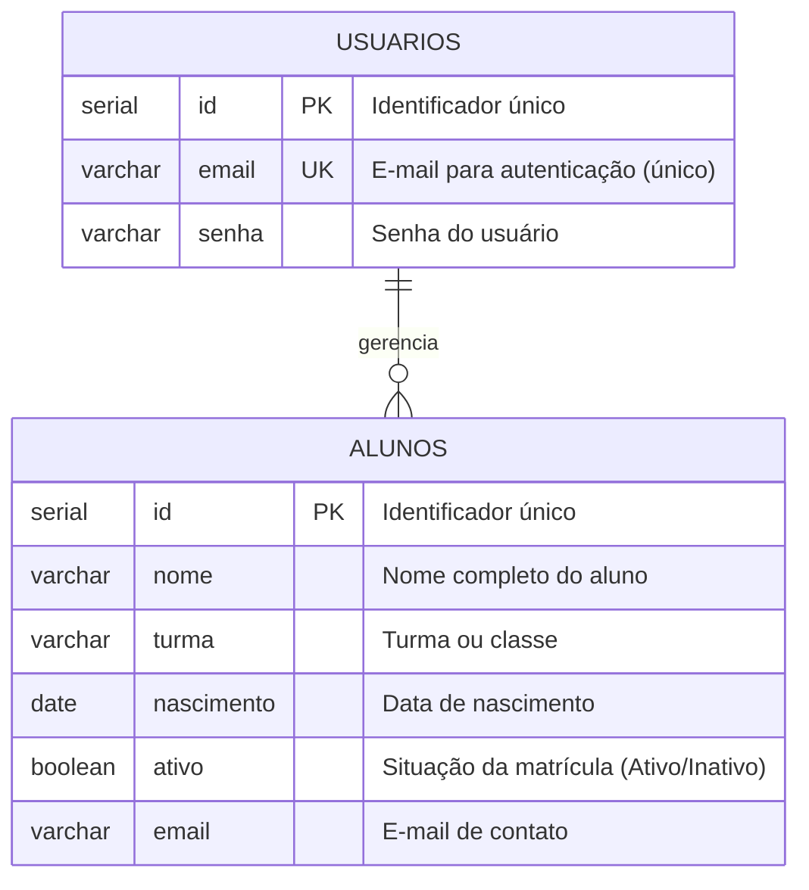

# Sistema de Gestão de Alunos

Mini aplicação web desenvolvida em **PHP** com banco de dados **PostgreSQL**, com o objetivo de simular um gerenciamento de alunos através de operações completas de CRUD (Create, Read, Update, Delete) e controle de autenticação de usuários via sessões.

---

## Sumário
1. [Sobre o Projeto](#sobre-o-projeto)
2. [Tecnologias Utilizadas](#tecnologias-utilizadas)
3. [Estrutura de Pastas e Arquivos](#estrutura-de-pastas-e-arquivos)
4. [Banco de Dados](#banco-de-dados)
5. [Como Executar o Projeto Localmente](#como-executar-o-projeto-localmente)
6. [Funcionalidades do Sistema](#funcionalidades-do-sistema)
7. [Segurança e Boas Práticas](#segurança-e-boas-práticas)

---

## Sobre o Projeto

O **Mini sistema de gestão de alunos** foi construído para simular um ambiente administrativo escolar simples e eficiente. A aplicação permite:
- Cadastrar e autenticar usuários com controle de sessão.
- Proteger páginas administrativas contra acessos não autorizados.
- Realizar o cadastro de novos alunos com informações completas (nome, turma, nascimento, e-mail e status ativo).
- Visualizar um relatório geral com todos os alunos cadastrados.
- Consultar os dados de um aluno específico pelo seu identificador (ID).
- Atualizar registros cadastrais de alunos existentes.
- Remover registros de alunos do banco de dados.

---

## Tecnologias Utilizadas

- **PHP** (Back-end e regras de negócio)
- **PostgreSQL** (Sistema Gerenciador de Banco de Dados relacional)
- **PDO (PHP Data Objects)** (Abstração e comunicação segura com o banco de dados)
- **HTML5** (Estruturação das páginas e formulários)
- **Sessões PHP (`$_SESSION`)** (Controle de autenticação e proteção de rotas)

---

## Estrutura de Pastas e Arquivos

O projeto adota uma divisão modular para organizar telas, regras de negócio e conexão:

```plaintext
mini_sistema/
│
├── index.php                 # Página inicial (boas-vindas e menu)
├── documentacao.md           # Documentação do projeto
│
├── app/                      # Telas e operações de CRUD dos alunos
│   ├── create.php            # Formulário e ação de cadastro de aluno
│   ├── select.php            # Relatório geral de todos os alunos
│   ├── select_w.php          # Consulta de aluno específico por ID
│   ├── update.php            # Formulário e ação de atualização de aluno
│   └── delete.php            # Formulário e ação de exclusão de aluno
│
├── database/                 # Conexão com o banco de dados
│   └── connect.php           # Script de conexão PDO com o PostgreSQL
│
├── includes/                 # Componentes reutilizáveis e regras
│   ├── header.php            # Cabeçalho global com menu de navegação
│   ├── footer.php            # Rodapé padrão do sistema
│   └── functions.php         # Funções SQL e regras de negócio reutilizáveis
│
└── login/                    # Módulo de acesso e autenticação
    ├── login.php             # Tela de login e autenticação
    ├── cadastrar.php         # Cadastro de novos usuários
    ├── logout.php            # Encerramento de sessão
    └── verifica_user.php     # Validação de sessão para proteger páginas
```

---

## Banco de Dados

O banco de dados relacional é estruturado em **PostgreSQL**, composto pelas entidades `usuarios` (controle de acesso e login) e `alunos` (gestão cadastral dos estudantes).

### Modelo Entidade-Relacionamento (MER)



### Script SQL de Criação (DDL)

```sql
-- Criação do banco de dados (opcional caso já exista)
CREATE DATABASE escola;

-- Conectar ao banco criado antes de executar os comandos abaixo:
-- \c escola;

-- Tabela de usuários para login
CREATE TABLE IF NOT EXISTS usuarios (
    id SERIAL PRIMARY KEY,
    email VARCHAR(150) NOT NULL UNIQUE,
    senha VARCHAR(255) NOT NULL
);

-- Tabela de alunos
CREATE TABLE IF NOT EXISTS alunos (
    id SERIAL PRIMARY KEY,
    nome VARCHAR(150) NOT NULL,
    turma VARCHAR(50) NOT NULL,
    nascimento DATE NOT NULL,
    ativo BOOLEAN DEFAULT TRUE,
    email VARCHAR(150) NOT NULL
);
```

---

## Como Executar o Projeto Localmente

### Pré-requisitos
1. **PHP 8.5** com a extensão `pdo_pgsql` habilitada no `php.ini`.
2. **PostgreSQL** instalado e ativo (porta padrão `5432`).
3. Navegador de internet moderno.

### Passo a Passo

#### 1. Configurar o Banco de Dados
Acesse o terminal do PostgreSQL (`psql` ou pgAdmin) e crie o banco e as tabelas executando o script SQL apresentado na seção anterior:
```bash
psql -U postgres -d escola -f schema.sql
```
*(ou cole os comandos SQL diretamente no console SQL)*.

#### 2. Configurar a Conexão no PHP
Abra o arquivo `database/connect.php` e ajuste as credenciais conforme o seu ambiente local:
```php
$host = "localhost";    // ou o IP do servidor do banco
$dbname = "escola";     // nome do banco criado
$user = "postgres";     // seu usuário do PostgreSQL
$pass = "sua_senha";    // sua senha do PostgreSQL
```

#### 3. Iniciar o Servidor Embutido do PHP
Abra o terminal na pasta raiz do projeto (`mini_sistema`) e execute:
```bash
php -S localhost:8000
```

#### 4. Acessar o Sistema
Abra o navegador e acesse:
```
http://localhost:8000/mini_sistema/index.php
```
*(ou `http://localhost:8000/index.php`, dependendo da raiz onde o servidor foi iniciado)*.

---

## Funcionalidades do Sistema

### 1. Módulo de Autenticação e Usuários
- **Cadastro de Usuário (`login/cadastrar.php`):** Permite registrar novos usuários no sistema informando e-mail e senha.
- **Login (`login/login.php`):** Valida o e-mail e a senha informados contra os dados cadastrados. Em caso de sucesso, inicializa a sessão (`$_SESSION['id']`) e redireciona para a página inicial.
- **Proteção de Acesso (`login/verifica_user.php`):** Arquivo incluído no topo de todas as páginas administrativas do CRUD. Caso o usuário não esteja logado, ele é automaticamente redirecionado para a tela de login.
- **Logout (`login/logout.php`):** Limpa as variáveis de sessão e destrói a sessão ativa.

### 2. Módulo de Gestão de Alunos (CRUD)
- **Cadastrar Aluno (`app/create.php`):** Formulário para cadastrar novos alunos com campos para nome, turma, e-mail, data de nascimento e seleção de status (ativo: Sim/Não).
- **Relatório de Alunos (`app/select.php`):** Lista todos os alunos registrados na base de dados com suas informações detalhadas.
- **Consultar Aluno por ID (`app/select_w.php`):** Permite buscar e visualizar as informações de um único aluno através de seu código identificador (ID).
- **Atualizar Aluno (`app/update.php`):** Permite editar todos os dados cadastrais de um aluno já existente a partir do seu ID.
- **Excluir Aluno (`app/delete.php`):** Permite a exclusão de um registro de aluno do banco de dados pelo ID.

---

## Segurança e Boas Práticas

- **Uso de Prepared Statements (PDO):** Todas as consultas que recebem dados do usuário utilizam `prepare()` e `bindParam()`, evitando vulnerabilidades a ataques de injeção de SQL (*SQL Injection*).
- **Reaproveitamento de Código:** O cabeçalho (`header.php`), rodapé (`footer.php`) e as funções de manipulação de dados (`functions.php`) estão modularizados em arquivos separados, facilitando manutenção e leitura do código.
- **Controle de Sessão:** Verificação centralizada para garantir que apenas pessoas autorizadas tenham acesso às funcionalidades de gerenciamento de alunos.

