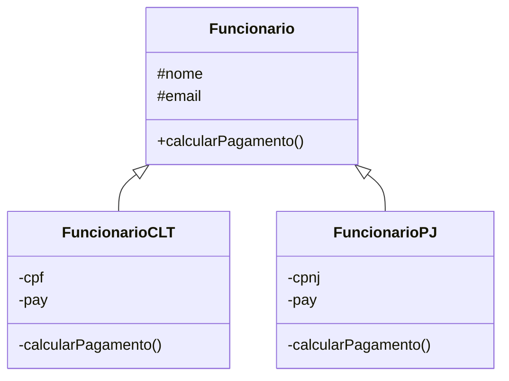

```mermaid
classDiagram
Funcionario <| -- FuncionarioCLT
Funcionario <| -- FuncionarioPJ

class Funcionario{
    #nome
    #email
    +calcularPagamento()
}

class FuncionarioCLT{
    -cpf
    -pay
    -calcularPagamento()
}
class FuncionarioPJ{
    -cpnj
    -pay
    -calcularPagamento()
}
```