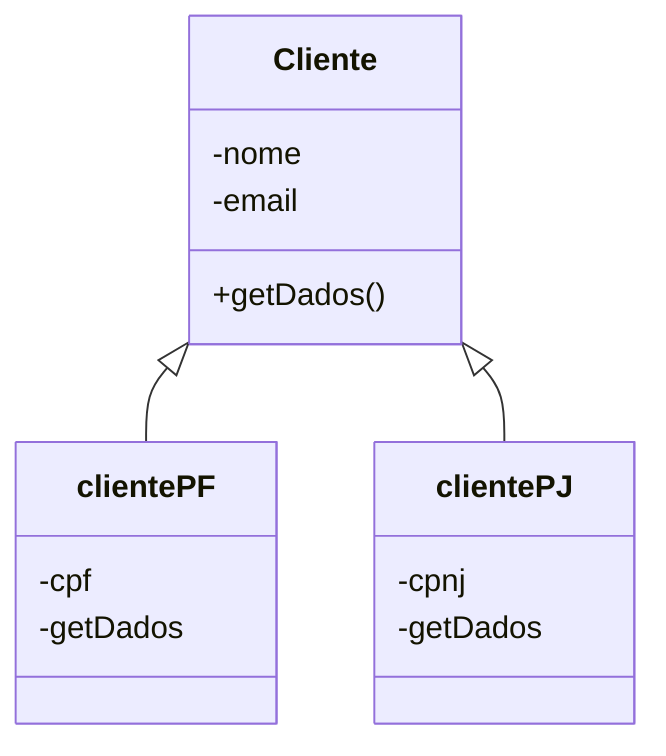

```mermaid
classDiagram
Cliente <| -- clientePF
Cliente <| -- clientePJ

class Cliente{
    -nome
    -email
    +getDados()
}

class clientePF{
    -cpf
    -getDados
}
class clientePJ{
    -cpnj
    -getDados
}
```