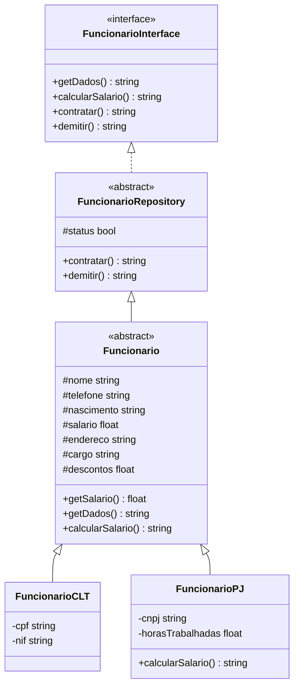

# Diagrama: funcionarios CLT/PJ

```mermaid
classDiagram
    FuncionarioInterface <|.. FuncionarioRepository
    FuncionarioRepository <|-- Funcionario
    Funcionario <|-- FuncionarioCLT
    Funcionario <|-- FuncionarioPJ

    class FuncionarioInterface {
        <<interface>>
        +getDados() string
        +calcularSalario() string
        +contratar() string
        +demitir() string
    }
    class FuncionarioRepository {
        <<abstract>>
        #status bool
        +contratar() string
        +demitir() string
    }
    class Funcionario {
        <<abstract>>
        #nome string
        #telefone string
        #nascimento string
        #salario float
        #endereco string
        #cargo string
        #descontos float
        +getSalario() float
        +getDados() string
        +calcularSalario() string
    }
    class FuncionarioCLT {
        -cpf string
        -nif string
    }
    class FuncionarioPJ {
        -cnpj string
        -horasTrabalhadas float
        +calcularSalario() string
    }
```
