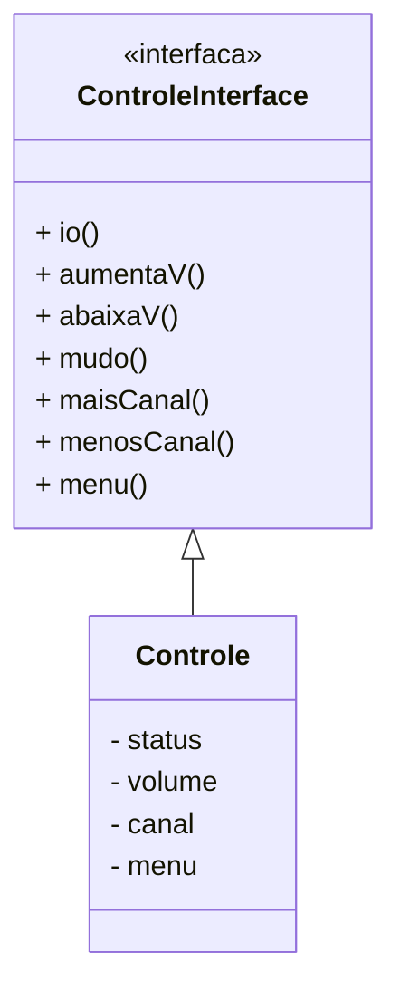

# diagrama de classes controle

```mermaid
classDiagram
ControleInterface <|-- Controle
class ControleInterface{
    <<interfaca>>
    + io()
    + aumentaV()
    + abaixaV()
    + mudo()
    + maisCanal()
    + menosCanal()
    + menu()
}

class Controle{
    - status
    - volume
    - canal
    - menu

  
}

```